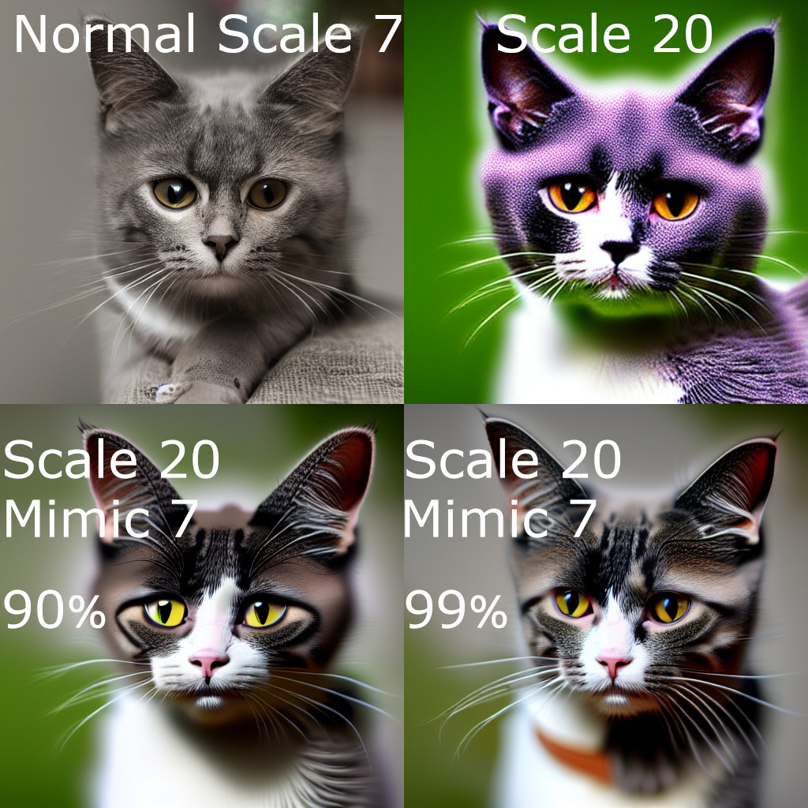
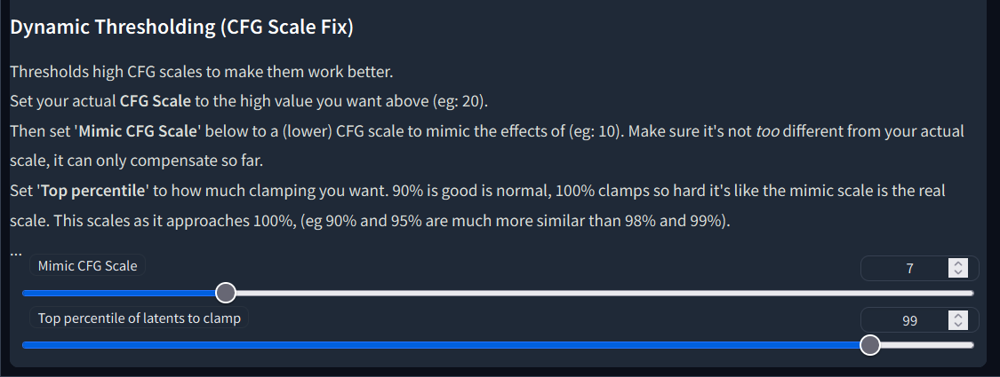
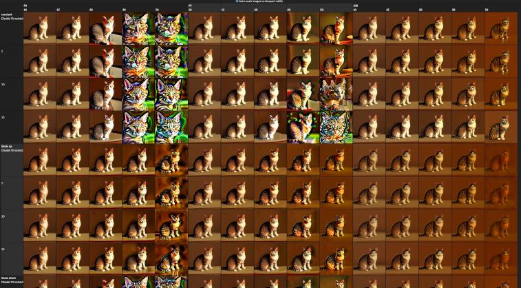
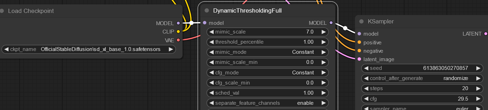

# Stable Diffusion Dynamic Thresholding (CFG Scale Fix)

### Concept

Extension for [SwarmUI](https://github.com/mcmonkeyprojects/SwarmUI), [ComfyUI](https://github.com/comfyanonymous/ComfyUI), and [AUTOMATIC1111 Stable Diffusion WebUI](https://github.com/AUTOMATIC1111/stable-diffusion-webui) that enables a way to use higher CFG Scales without color issues.

This works by clamping latents between steps. You can read more [here](https://github.com/AUTOMATIC1111/stable-diffusion-webui/pull/3962) or [here](https://github.com/AUTOMATIC1111/stable-diffusion-webui/issues/3268) or [this tweet](https://twitter.com/Birchlabs/status/1582165379832348672).

--------------

### Credit

The core functionality of this PR was originally developed by [Birch-san](https://github.com/Birch-san) and ported to the WebUI by [dtan3847](https://github.com/dtan3847), then converted to an Auto WebUI extension and given a UI by [mcmonkey4eva](https://github.com/mcmonkey4eva), further development and research done by [mcmonkey4eva](https://github.com/mcmonkey4eva) and JDMLeverton. Ported by ComfyUI by [TwoDukes](https://github.com/TwoDukes) and [mcmonkey4eva](https://github.com/mcmonkey4eva). Ported to SwarmUI by [mcmonkey4eva](https://github.com/mcmonkey4eva).

--------------

### Examples

--------------

### Demo Grid

View at <https://sd.mcmonkey.org/dynthresh/>.

(Was generated via [this YAML config](https://gist.github.com/mcmonkey4eva/fccd29172f44424dfc0217a482c824f6) for the [Infinite Grid Generator](https://github.com/mcmonkeyprojects/sd-infinity-grid-generator-script))

--------------

### Installation and Usage

#### SwarmUI

- Supported out-of-the-box on default installations.
    - If using a custom installation, just make sure the backend you use has this repo installed per the instructions specific to the backend as written below.
- It's under the "Display Advanced Options" parameter checkbox.

#### Auto WebUI

- You must have the [AUTOMATIC1111 Stable Diffusion WebUI](https://github.com/AUTOMATIC1111/stable-diffusion-webui) already installed and working. Refer to that project's readme for help with that.
- Open the WebUI, go to the `Extensions` tab
- -EITHER- Option **A**:
    - go to the `Available` tab with
    - click `Load from` (with the default list)
    - Scroll down to find `Dynamic Thresholding (CFG Scale Fix)`, or use `CTRL+F` to find it
- -OR- Option **B**:
    - Click on `Install from URL`
    - Copy/paste this project's URL into the `URL for extension's git repository` textbox: `https://github.com/mcmonkeyprojects/sd-dynamic-thresholding`
- Click `Install`
- Restart or reload the WebUI
- Go to txt2img or img2img
- Check the `Enable Dynamic Thresholding (CFG Scale Fix)` box
- Read the info on-page and set the sliders where you want em.
- Click generate.

#### ComfyUI

- Must have [ComfyUI](https://github.com/comfyanonymous/ComfyUI) already installed and working. Refer to that project's readme for help with that.
- -EITHER- Option **A**: (TODO: Manager install)
- -OR- Option **B**:
    - `cd ComfyUI/custom_nodes`
    - `git clone https://github.com/mcmonkeyprojects/sd-dynamic-thresholding`
    - restart ComfyUI
    - Add node `advanced/mcmonkey/DynamicThresholdingSimple` (or `Full`)
    - Link your model to the input, and then link the output model to your KSampler's input

--------------

### Supported Auto WebUI Extensions

- This can be configured within the [Infinity Grid Generator](https://github.com/mcmonkeyprojects/sd-infinity-grid-generator-script#supported-extensions) extension, see the readme of that project for details.

### ComfyUI Compatibility

- This would work with any variant of the `KSampler` node, including custom ones, so long as they do not totally override the internal sampling function (most don't).

----------------------

### Licensing pre-note:

This is an open source project, provided entirely freely, for everyone to use and contribute to.

If you make any changes that could benefit the community as a whole, please contribute upstream.

### The short of the license is:

You can do basically whatever you want, except you may not hold any developer liable for what you do with the software.

### The long version of the license follows:

The MIT License (MIT)

Copyright (c) 2023 Alex "mcmonkey" Goodwin

Permission is hereby granted, free of charge, to any person obtaining a copy
of this software and associated documentation files (the "Software"), to deal
in the Software without restriction, including without limitation the rights
to use, copy, modify, merge, publish, distribute, sublicense, and/or sell
copies of the Software, and to permit persons to whom the Software is
furnished to do so, subject to the following conditions:

The above copyright notice and this permission notice shall be included in all
copies or substantial portions of the Software.

THE SOFTWARE IS PROVIDED "AS IS", WITHOUT WARRANTY OF ANY KIND, EXPRESS OR
IMPLIED, INCLUDING BUT NOT LIMITED TO THE WARRANTIES OF MERCHANTABILITY,
FITNESS FOR A PARTICULAR PURPOSE AND NONINFRINGEMENT. IN NO EVENT SHALL THE
AUTHORS OR COPYRIGHT HOLDERS BE LIABLE FOR ANY CLAIM, DAMAGES OR OTHER
LIABILITY, WHETHER IN AN ACTION OF CONTRACT, TORT OR OTHERWISE, ARISING FROM,
OUT OF OR IN CONNECTION WITH THE SOFTWARE OR THE USE OR OTHER DEALINGS IN THE
SOFTWARE.
